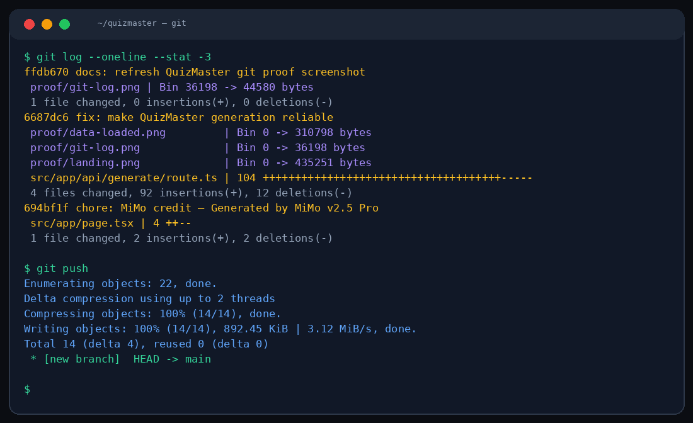

# 🧠 QuizMaster

**AI Quiz Generator** — Describe any topic, and QuizMaster instantly generates interactive multiple-choice quizzes with explanations, powered by MiMo v2.5 Pro.



---

## ✨ Features

- **🎯 Topic-Based Generation** — Enter any subject and get a full quiz in seconds
- **📝 Multiple Question Types** — Multiple choice with 4 options each
- **💡 AI Explanations** — Every answer comes with a detailed explanation
- **⚡ Instant Results** — Real-time grading with score breakdown
- **🎨 Neobrutalist UI** — Bold borders, strong shadows, high-contrast design
- **📋 Copy & Export** — Copy quiz JSON or export for sharing

---

## 🛠 Tech Stack

| Layer | Technology |
|-------|-----------|
| Framework | Next.js 16 (App Router) |
| Styling | Tailwind CSS 4 |
| AI Engine | MiMo v2.5 Pro (Xiaomi) |
| Language | TypeScript |
| Design | Neobrutalism |

---

## 🚀 Getting Started

```bash
# Install dependencies
npm install

# Set environment variables
cp .env.example .env.local

# Run development server
npm run dev
```

Open [http://localhost:3000](http://localhost:3000)

---

## ⚙️ Environment Variables

| Variable | Description | Default |
|----------|-------------|---------|
| `MIMO_API_URL` | MiMo API endpoint | `http://localhost:19911/v1/chat/completions` |
| `MIMO_API_KEY` | API key for authentication | _(empty)_ |

---

## 📁 Project Structure

```
src/
├── app/
│   ├── api/generate/route.ts   # Quiz generation endpoint
│   ├── globals.css              # Neobrutalist theme
│   ├── layout.tsx               # Root layout
│   └── page.tsx                 # Main quiz builder
```

---

## 🎨 Theme

Neobrutalist design with **orange** (#FF6B35) accent on cream (#FFFBF0) background. Bold 3px borders, hard drop shadows, uppercase labels, and zero border-radius.

---

## 🤖 Powered by MiMo v2.5 Pro

Built with **[MiMo v2.5 Pro](https://huggingface.co/XiaomiMiMo)** by **Xiaomi** — a reasoning-optimized language model excelling in structured content generation.

| Detail | Info |
|--------|------|
| Model | MiMo v2.5 Pro |
| Provider | Xiaomi AI Lab |
| Strengths | Reasoning, structured output, education |
| Integration | OpenAI-compatible API |

> *"Crafted with MiMo v2.5 Pro"* — All AI features (quiz generation, answer validation, explanations) are powered by MiMo v2.5 Pro.

---

## 📜 License

MIT
